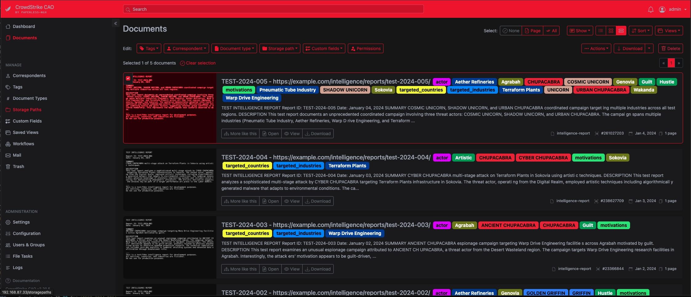
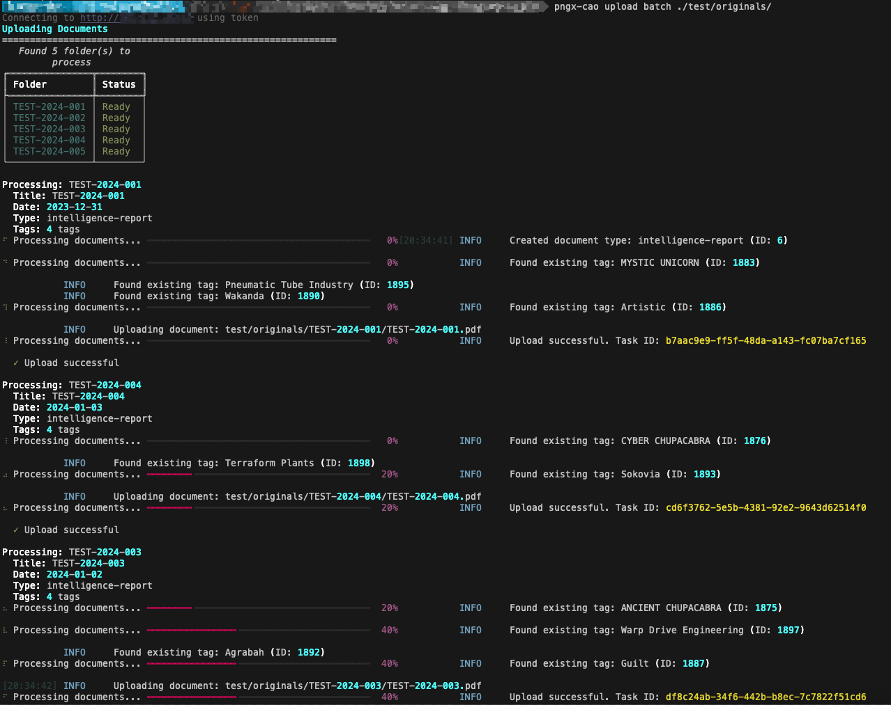

# pngx-cao: Paperless-ngx Tools for CrowdStrike Falcon CAO Intel Reports

[](https://www.python.org/downloads/)
[](https://opensource.org/licenses/MIT)
[](https://github.com/cs-shadowbq/paperless-ngx-tools/graphs/commit-activity)
[](https://docs.paperless-ngx.com/)
[](https://github.com/cs-shadowbq/paperless-ngx-tools/actions/workflows/test.yml)

Command-line tools for managing Paperless-ngx with CrowdStrike CAO threat intelligence reports. Create hierarchical taxonomy tags and upload documents with rich metadata automatically.

## Features

- **Hierarchical Taxonomy Management** - Create and manage complex tag structures from CSV files
- **Intelligent Document Upload** - Automatically process CrowdStrike CAO reports with metadata
- **Directory Watcher** - Daemonize and automatically upload new documents as they appear
- **Duplicate Handling** - Skip, replace, or update existing documents
- **Progress Tracking** - Clear feedback with progress bars and status tables

## Supported Taxonomies

- **Actors** - Threat actor names organized by animal type (tier hierarchy: Animal → Individual Actor)
- **Motivations** - What drives the threat actors
- **Targeted Countries** - Geographic regions and countries
- **Targeted Industries** - Industry sectors and verticals

PaperlessNGX-CAO Web Interface Example:



CLI Example:



## Quick Start

### Installation

```bash
# Navigate to the project directory
cd paperless-ngx-cao-tools

# Install in local editable mode
pip install -e .
```

### Configuration

Create a `.env` file, or copy the `.env.example` into your working directory and edit it:

```bash
# Paperless-ngx Configuration
PAPERLESS_URL=http://192.168.1.100:8000
PAPERLESS_TOKEN=your_api_token_here

# Optional: Set to 'false' to assign ownership to documents
PAPERLESS_GLOBAL_READ=true

# Optional: Directory paths (defaults shown)
# PAPERLESS_DATA_DIR=./data
# PAPERLESS_ORIGINALS_DIR=./originals

# Optional: Use environment prefix for multiple instances
ENV_PREFIX=BOX1_
```

### Basic Usage

```bash
# Verify your connection and credentials first
pngx-cao validate

# Create all taxonomies from CSV files
pngx-cao taxonomy create --all

# Create specific taxonomy
pngx-cao taxonomy create -t actor

# List available taxonomies (local CSV files)
pngx-cao taxonomy list

# Check what's already on the server
pngx-cao taxonomy remote

# Validate CSV files
pngx-cao taxonomy validate

# Upload all documents from originals directory
pngx-cao upload batch ./originals

# Upload a single document folder
pngx-cao upload folder ./originals/CSIT-10001

# Watch a directory for new documents (daemon mode)
pngx-cao upload watch ./originals

# Test without actually uploading (dry run)
pngx-cao upload batch ./originals --dry-run
```

## CLI Commands

### Validate Command

```bash
# Test your Paperless-ngx connection and credentials
pngx-cao validate [OPTIONS]

Options:
  --env-file PATH    Path to .env file
  --env-prefix TEXT  Environment variable prefix
  --url TEXT         Paperless-ngx URL (overrides env)
  --token TEXT       API token (overrides env)
  -k, --skip-ssl-verify  Skip SSL certificate verification (insecure)
  --debug            Enable debug logging

# This command checks:
# - Configuration file loading
# - API client initialization
# - Server connectivity
# - Authentication validity
# - API version compatibility
```

### Taxonomy Commands

```bash
# Create taxonomies
pngx-cao taxonomy create [OPTIONS]

Options:
  -t, --taxonomy [actor|motivations|targeted_countries|targeted_industries|all]
                                  Which taxonomy to create (default: all)
  --data-dir PATH                 Directory containing CSV files
  --env-file PATH                 Path to .env file
  --env-prefix TEXT               Environment variable prefix
  --url TEXT                      Paperless-ngx URL (overrides env)
  --token TEXT                    API token (overrides env)
  -k, --skip-ssl-verify           Skip SSL certificate verification (insecure)
  --debug                         Enable debug logging

# List available taxonomies (local CSV files check only)
pngx-cao taxonomy list [OPTIONS]

# Check taxonomy status on remote server
pngx-cao taxonomy remote [OPTIONS]

Options:
  --env-file PATH         Path to .env file
  --env-prefix TEXT       Environment variable prefix
  --url TEXT              Paperless-ngx URL (overrides env)
  --token TEXT            API token (overrides env)
  -k, --skip-ssl-verify   Skip SSL certificate verification (insecure)
  --debug                 Enable debug logging

# Validate CSV files (local check only)
pngx-cao taxonomy validate [OPTIONS]
```

### Upload Commands

```bash
# Batch upload documents
pngx-cao upload batch [OPTIONS] ORIGINALS-DIR

Options:
  --folder TEXT                   Process only this specific folder by name
  --dry-run                       Process folders but do not actually upload
  --duplicate-handling [skip|replace|update-metadata]
                                  How to handle duplicate documents:
                                  - skip: Skip if exists (default)
                                  - replace: Delete and re-upload
                                  - update-metadata: Update tags/metadata only
  --env-file PATH                 Path to .env file
  --env-prefix TEXT               Environment variable prefix
  --url TEXT                      Paperless-ngx URL (overrides env)
  --token TEXT                    API token (overrides env)
  -k, --skip-ssl-verify           Skip SSL certificate verification (insecure)
  --debug                         Enable debug logging

# Upload single folder
pngx-cao upload folder [OPTIONS] FOLDER-PATH

# Watch directory for new documents (daemon mode)
pngx-cao upload watch [OPTIONS] ORIGINALS-DIR

Options:
  --poll-interval FLOAT           Seconds between directory scans (default: 5.0)
  --stability-wait FLOAT          Seconds to wait for folder stability (default: 2.0)
  --duplicate-handling [skip|replace|update-metadata]
                                  How to handle duplicate documents (default: skip)
  --env-file PATH                 Path to .env file
  --env-prefix TEXT               Environment variable prefix
  --url TEXT                      Paperless-ngx URL (overrides env)
  --token TEXT                    API token (overrides env)
  -k, --skip-ssl-verify           Skip SSL certificate verification (insecure)
  --debug                         Enable debug logging

# Examples
pngx-cao upload batch ./originals
pngx-cao upload batch ./originals --folder CSIT-10001
pngx-cao upload batch ./originals --duplicate-handling replace
pngx-cao upload folder ./originals/CSIR-12012 --duplicate-handling update-metadata

# Watch directory (runs continuously until Ctrl+C)
pngx-cao upload watch ./originals
pngx-cao upload watch ./originals --poll-interval 2 --duplicate-handling replace
pngx-cao upload watch ./originals --stability-wait 5  # For slower file operations
```

## Project Structure

```txt
paperless-ngx-tools/
├── src/
│   └── pngx_cao/                # Main package
│       ├── __init__.py
│       ├── cli.py               # CLI entry point
|       ├── cli_utils.py         # CLI utility functions
│       ├── config.py            # Configuration management
│       ├── api/
│       │   ├── __init__.py
│       │   └── client.py        # PaperlessNGX API client
│       ├── commands/
│       │   ├── __init__.py
│       │   ├── taxonomy.py      # Taxonomy commands
│       │   ├── validate.py      # Validate command
│       │   └── upload.py        # Upload commands
│       ├── services/
│       │   ├── __init__.py
│       │   ├── taxonomy.py      # Taxonomy business logic
│       │   ├── upload.py        # Upload business logic
│       │   └── watcher.py       # Directory watcher service
│       └── utils/
│           ├── __init__.py
│           ├── constants.py     # Constants and configurations
│           └── csv_reader.py    # CSV utilities
├── bin/                         
│   └── pngx-cao                 # Executable script

├── test/                        # Test suite
│   ├── __init__.py
│   ├── README.md                # Test suite documentation
│   ├── test_config.py           # Configuration tests
│   ├── test_constants.py        # Constants tests
│   ├── test_csv_reader.py       # CSV reader tests
│   ├── test_reports.py          # Report validation tests
│   ├── test_watcher.py          # Watcher service tests
│   ├── data/                    # Test CSV taxonomy data
│   │   ├── actors.csv
│   │   ├── motivations.csv
│   │   ├── targeted_countries.csv
│   │   └── targeted_industries.csv
│   └── originals/               # Test report metadata and PDFs
│       ├── TEST-2024-001/
│       ├── TEST-2024-002/
│       ├── TEST-2024-003/
│       ├── TEST-2024-004/
│       └── TEST-2024-005/
├── docs/                        # Documentation
│   ├── WATCHER.md               # Watcher quick reference
│   └── pngx-cao-watcher.service.example  # Systemd service file
├── data/                        # CSV taxonomy files (configurable via PAPERLESS_DATA_DIR)
│   ├── actors.csv
│   ├── motivations.csv
│   ├── targeted_countries.csv
│   └── targeted_industries.csv
├── originals/                   # Document folders for upload (configurable via PAPERLESS_ORIGINALS_DIR)
│   └── CSIT-XXXXX/
│       ├── CSIT-XXXXX.pdf
│       └── CSIT-XXXXX.json
├── pyproject.toml               # Modern Python project configuration
├── pytest.ini                   # Pytest configuration
├── README.md                    # This file
├── README-TEST-DATA.md          # Test data documentation
└── .env                         # Environment configuration (create this)
```

## Document Structure

Each document folder in `originals/` should contain:

1. **PDF file** - The document to upload (e.g., `CSIT-10001.pdf`)
2. **JSON metadata file** - CrowdStrike CAO report data (e.g., `CSIT-10001.json`)

Example JSON structure:

```json
{
  "name": "Report Title",
  "url": "https://...",
  "short_description": "Description",
  "type": {"slug": "intelligence-report"},
  "created_date": 1640000000,
  "actors": [{"name": "XXXXX UNICORN"}],
  "target_industries": [{"value": "Warp Drive Manufacturing"}],
  "target_countries": [{"value": "Wakanda"}],
  "motivations": [{"value": "Hustle"}]
}
```

## CSV File Format

### Simple Taxonomies (motivations, targeted_countries, targeted_industries)

Single column format:

```csv
"Artistic"
"Hustle"
"..."
```

The tool creates tags under a single tier hierarchy with a parent tag (e.g., "Motivations").

```txt
Motivations
├── Artistic
├── Hustle
└── ...
```

### Actor Taxonomy

Multi-column format with header:

```csv
"Name","Origins","ID"
"XXXXX UNICORN","Enchanted Forest","1"
"YYYYY UNICORN","Enchanted Forest","2"
"AAAAA GRIFFIN","Cloud City","3"
```

The tool automatically extracts the animal type from the last word and creates a 3-tier hierarchy:

```txt
Actors
├── UNICORN
│   ├── XXXXX UNICORN
│   └── YYYYY UNICORN
└── GRIFFIN
    └── AAAAA GRIFFIN
```

**Note:** Actor tags support keywords in parentheses (e.g., `HYPER BASALISK (inactive)`) for status tracking. When uploading reports, the tool matches actor names with or without keywords.

## Directory Watcher (Daemon Mode)

The `watch` command monitors a directory for new document folders and automatically uploads them when they're ready. This is ideal for automated workflows, continuous integration, or integration with other tools.

### How It Works

1. **Polling**: Scans the watch directory every `poll-interval` seconds for new folders
2. **Stabilization**: Waits for folder contents to stabilize (no changes for `stability-wait` seconds)
3. **Upload**: Automatically uploads the document using the same logic as `upload folder`
4. **Tracking**: Remembers processed folders to avoid re-uploading

### Use Cases

- **Archive Extraction**: Extract threat reports to a watched directory
- **Dropbox Integration**: Monitor a shared folder for new reports
- **CI/CD Pipeline**: Automatically process documents as they're generated
- **Scheduled Downloads**: Pair with cron/scheduled tasks to download and auto-upload

### Configuration Options

| Option | Default | Description |
|--------|---------|-------------|
| `--poll-interval` | 5.0 | Seconds between directory scans. Lower = more responsive, higher = less CPU |
| `--stability-wait` | 2.0 | Seconds to wait for no file changes before uploading. Increase for slow extractions |
| `--duplicate-handling` | skip | How to handle existing documents (skip/replace/update-metadata) |

### Examples - `upload watch`

```bash
# Basic watcher - check every 5 seconds
pngx-cao upload watch ./originals

# Faster response - check every 2 seconds
pngx-cao upload watch ./originals --poll-interval 2

# For slow archive extractions - wait 5 seconds for stability
pngx-cao upload watch ./originals --stability-wait 5

# Replace existing documents automatically
pngx-cao upload watch ./originals --duplicate-handling replace

# Run as background service (Linux/macOS)
nohup pngx-cao upload watch ./originals > watcher.log 2>&1 &

# Run with systemd (create a service file)
# See documentation for systemd service example
```

### Stopping the Watcher

- **Interactive**: Press `Ctrl+C` to gracefully stop
- **Background**: Find process ID and send SIGTERM: `kill <pid>`
- **Systemd**: `sudo systemctl stop pngx-cao-watcher`

### Important Notes

- ⚠️ Folders are only processed once - restarting the watcher won't reprocess existing folders
- ⚠️ The watcher uses polling (not inotify) for maximum compatibility with network shares
- ⚠️ If a folder is unstable (still being written), it's skipped and rechecked on the next scan
- ✅ Works across platforms (Linux, macOS, Windows) and with network file systems
- ✅ Safe to run continuously - minimal CPU/memory footprint

## Duplicate Document Handling

When uploading documents, you can control how the tool handles documents that already exist in Paperless-ngx (based on exact title match):

### Strategies

- **`skip` (default)** - Skip uploading if a document with the same title exists. This is the safest option.
- **`replace`** - Delete the existing document, empty the trash, and upload the new version. Use this when you have updated document files.
- **`update-metadata`** - Keep the existing document file but update its tags, created date, and other metadata. Use this to refresh taxonomy without re-uploading files.

### Examples - `upload batch`

```bash
# Skip duplicates (default behavior)
pngx-cao upload batch ./originals

# Replace existing documents with new versions
pngx-cao upload batch ./originals --duplicate-handling replace

# Update only the metadata/tags, keep existing files
pngx-cao upload batch ./originals --duplicate-handling update-metadata

# Preview what would happen without making changes
pngx-cao upload batch ./originals --duplicate-handling replace --dry-run
```

### Notes

- Paperless-ngx's file-based consumer has a `PAPERLESS_CONSUMER_DELETE_DUPLICATES` configuration option that handles duplicates during directory consumption.
- The API upload (used by this tool) does not have a native "force overwrite" option, so this tool implements duplicate handling strategies.
- The `replace` strategy permanently deletes the old document - use with caution!
- Title matching is case-sensitive and must be an exact match.

## SSL Certificate Verification

When connecting to Paperless-ngx over HTTPS with self-signed certificates, you can skip SSL certificate verification:

### Using the -k Flag

```bash
# Skip SSL verification for a single command
pngx-cao validate -k --url https://paperless.local

# Works with all commands
pngx-cao taxonomy create -k
pngx-cao upload batch ./originals -k
```

### Using Environment Variable

Set in your `.env` file:

```bash
PAPERLESS_URL=https://paperless.local
PAPERLESS_TOKEN=your_token
PAPERLESS_SKIP_SSL_VERIFY=true
```

### Security Warning

⚠️ **Disabling SSL verification is insecure** and should only be used:

- In development/testing environments
- With self-signed certificates on trusted local networks
- Never in production with sensitive data

When SSL verification is disabled, the tool will display a warning: `(SSL verification disabled)`

## Environment Variables

All environment variables support an optional prefix via `ENV_PREFIX`:

| Variable | Description | Default |
|----------|-------------|---------|
| `PAPERLESS_URL` | Base URL of Paperless-ngx instance | Required |
| `PAPERLESS_TOKEN` | API authentication token | Required* |
| `PAPERLESS_USERNAME` | Username for basic auth | Required* |
| `PAPERLESS_PASSWORD` | Password for basic auth | Required* |
| `PAPERLESS_GLOBAL_READ` | Set to 'false' to assign ownership | `true` |
| `PAPERLESS_SKIP_SSL_VERIFY` | Skip SSL certificate verification (insecure) | `false` |
| `PAPERLESS_DUPLICATE_HANDLING` | How to handle duplicates: skip, replace, update-metadata | `skip` |
| `PAPERLESS_DATA_DIR` | Directory containing taxonomy CSV files | `./data` |
| `PAPERLESS_ORIGINALS_DIR` | Directory containing document folders for upload | `./originals` |
| `PAPERLESS_API_VERSION` | API version to use | `9` |
| `ENV_PREFIX` | Prefix for all variables (e.g., "BOX1_") | None |

*Either `PAPERLESS_TOKEN` or `PAPERLESS_USERNAME`/`PAPERLESS_PASSWORD` is required.

## Development

### Setup Development Environment

```bash
# Make sure the package is installed
pip install -e .

# Verify installation
pip show pngx-cao
pngx-cao --version
```

### Connection Errors

```bash
# Test configuration
pngx-cao taxonomy list --debug

# Check Paperless-ngx is accessible
curl http://your-paperless-url/api/
```

### CSV File Issues

```bash
# Validate your CSV files
pngx-cao taxonomy validate

# Check file encoding (should be UTF-8)
file -I data/actors.csv
```

### Logging

```bash
# Enable debug logging for detailed output
pngx-cao upload batch ./originals --debug
```
